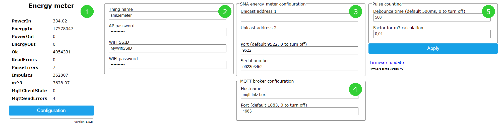

= D0-SML to SMA Energy Meter converter
Joern Tuemmler
v1.2, September 2019: Final
:doctype: article
:encoding: utf-8
:lang: en
:toc: left
:toclevels: 3
:sectnums:
:icons: font
:source-highlighter: coderay

== Introduction

This sketch may be used to read SML telegrams from an infrared D0 interface, convert it to SMA energy-meter telegrams and send it via UDP.

So far it has been tested with the following meters:

* https://www.dzg.de/fileadmin/dzg/content/downloads/produkte-zaehler/dvs74/dzg_dvs74_handbuch.pdf[DWS74] from Deutsche Zählergesellschaft Oranienburg mbH

As hardware you need:

* an ESP8266 (tested with NodeMCUv2 and WeMos D1 mini)
* or a Raspberry Pi (tested with a Raspberry Pi 2)
* a BPW40 phototransistor
* and optionally a 1 KOhm resistor (only needed with a Raspberry Pi)

[CAUTION]
====
The source-code and the information in this document is provided _as is_. Use it at your own risk!
====

****
Thanks to Frank Carius for sharing his work. https://www.msxfaq.de/sonst/bastelbude/smartmeter_d0_sml.code.htm[His sketch] was the initial basis of this sketch.
****

== Setup

=== ESP8266

==== Hardware

Attach the BPW40 phototransistor to your ESP8266:

* Short leg (collector, anode) to RxD
* Long leg (emitter, cathode) to GND

[NOTE]
====
TxD is used to print debug-output.
====

==== Software

You need the https://www.arduino.cc/en/Main/Software[Arduino IDE] in order to compile and flash the sketch to the ESP8266.

Follow the instructions on https://github.com/esp8266/Arduino[ESP8266 github project page] or  https://www.heise.de/ct/artikel/Arduino-IDE-installieren-und-fit-machen-fuer-ESP8266-und-ESP32-4130814.html[from ct magazine] to setup your environment.

As an additional dependency you need https://github.com/prampec/IotWebConf[IotWebConf, Version 2.3.0]. Install this library via the Arduino IDE.

.Configuration
After compiling and flashing the software, the ESP8266 provides a WiFi access point with the name *sml2emeter*. To configure the software, connect to this access point with the password *sml2emeter*. If supported by your mobile device, you will be automatically redirected to the web-server of the ESP. If not, open a web-browser and enter the ip-address *192.168.4.1*.

If the ESP already receives data from you energy meter, you should see an image like in [1].

To configure the ESP, press the [Configuration] button. 

[NOTE]
====
If the device was already configured, you are asked for a username and password. The username is *admin* and the password the current AP password.
====

The configuration page is divided into two sections: WiFi configuration [2] and meter configuration [3].

.WiFi configuration

Thing name:: Name of the device. This name is also used when in AP mode.
AP password:: Password to connect to the device when in AP mode (*mandatory*). This password is also needed to change the configuration once the device is set up.
WiFi SSID:: The name of the WiFi network (*mandatory*).
WiFi password:: The password to connect to the WiFi network (*mandatory*).

.Meter configuration

Unicast address 1/2:: Up to two unicast addresses may be specified as destination address for the energy-meter telegrams. If none is set, the default multicast address is used.
Port:: Destination port for the energy-meter telegrams. The default is 9522. If any other port greater than 0 is set, raw SML packets will be send. If this value is set to 0, sending of energy-meter telegrams is turned off.
Serial number:: The serial number which is used in the energy-meter telegrams.

=== Raspberry Pi

The software was originally developed for an ESP8266. Experimental support for the Raspberry Pi has been added and tested with a RaspberryPi 2. This version comes without a webui.

==== Hardware

Check the documentation from https://pgoergen.de/de/2018/05/build-a-smartmeter-reading-head-for-1e/[Paul Görgen] for settings up the Raspberry Pi and the hardware. In short:

* Short leg (collector, anode) of the BPW40 to RxD
* Long leg (emitter, cathode) of the BPW40 to GND
* Put the resistor between RxD and 3,3V

[NOTE]
====
In Paul Görgens https://pgoergen.de/de/2018/05/build-a-smartmeter-reading-head-for-1e/[tutorial] the BPW40 is used without a resistor. In my case this didn't work and only fragments were received. Adding the resistor fixed that problem.
====

==== Software

You can compile the code directly on a Raspberry Pi. First run CMake to create a makefile, then use make to compile the application:

....
mkdir build
cd build
cmake ..
make
....

Please note that you have to configure your Raspberry Pi to use the serial interface for an own application (see documentation above) and to setup communication parameters to 9600 8N1.

Start the application by specifying the port, e.g.:

....
./sml2emeter /dev/ttyAMA0
....

== Background information

=== Developing on a PC

For faster and more comfortable development it is possible to use https://visualstudio.microsoft.com/de/[Visual Studio] or a GNU toolchain for compiling the sketch and running it on a PC. To create a solution, you need to run https://cmake.org[CMake] first.

=== Links

* https://www.bsi.bund.de/SharedDocs/Downloads/DE/BSI/Publikationen/TechnischeRichtlinien/TR03109/TR-03109-1_Anlage_Feinspezifikation_Drahtgebundene_LMN-Schnittstelle_Teilb.pdf?__blob=publicationFile[Technische Richtlinie BSI TR-03109-1 / SML]
* https://www.bundesnetzagentur.de/DE/Service-Funktionen/Beschlusskammern/BK06/BK6_81_GPKE_GeLi/Mitteilung_Nr_20/Anlagen/Obis-Kennzahlen-System_2.0.pdf?__blob=publicationFile&v=2[OBIS-Kennzahlen-System]
* https://www.promotic.eu/en/pmdoc/Subsystems/Comm/PmDrivers/IEC62056_OBIS.htm[OBIS codes]
* https://www.sma.de/fileadmin/content/global/Partner/Documents/SMA_Labs/EMETER-Protokoll-TI-de-10.pdf[SMA ENERGY METER Zählerprotokoll]

=== Example SML message

.General structure of a SML message
....
SML {
	transactionId
	groupNo
	abortOnError
	messageBody
	crc16
	endOfMsg
}
....
Reference: p. 17

.Example message
....
76                                                list                   SML message
   05 52 f1 58 00                                 string = R.X.          transactionId
   62 00                                          uint = 0               groupNo
   62 00                                          uint = 0               abortOnError(0 == continue, p.19)
   72                                             list                   messageBody (p.20)
      63 01 01                                    uint = 257               SML_PublicOpen.Res (p.22)
      76                                          list
         01                                       optional, not used         codepage
         01                                       optional, not used         clientId
         02 31                                    string = 1                 reqFileId
         0b 0a 01 44 5a 47 00 ff 00 ff 00         string = ..DZG.....        serverId
         72                                       list                       refTime
            62 01                                 uint                         type of time(1 == unsigned)
            64 1d a6 aa                           uint = 1943210
         62 02                                    uint = 2                   smlVersion
   63 d4 f4                                       uint = 54516           crc16
   00                                             endOfMessage
76                                                list                   SML message
   05 53 f1 58 00                                 string = S.X.          transactionId
   62 00                                          uint = 0               groupNo
   62 00                                          uint = 0               abortOnError(0 == continue, p.19)
   72                                             list                   messageBody (p.20)
      63 07 01                                    uint = 1793              SML_GetList.Res (p.36)
      77                                          list
         01                                       optional, not used         clientId
         0b 0a 01 44 5a 47 00 ff 00 ff 00         string = ..DZG.....        serviceId
         07 01 00 62 0a ff ff                     string = ......            listName
         72                                       list                       actSensorTime
            62 01                                 uint = 1
            64 1d a6 aa                           uint = 1943210
         75                                       list                       valList
            77                                    list
               07 01 00 60 01 00 ff               octed                      obis:Hardware version
               01                                 optional, not used
               72                                 list
                  62 01                           uint = 1
                  62 00                           uint = 0
               62 00                              uint = 0
               52 00                              int = 0
               04 44 5a 47                        string = DZG
               01                                 optional, not used
            77                                    list
               07 01 00 60 01 00 ff               octed                      obis:Device identification
               01                                 optional, not used
               72                                 list
                  62 01                           uint = 1
                  62 00                           uint = 0
               62 00                              uint = 0
               52 00                              int = 0
               0b 0a 01 44 5a 47 00 ff 00 ff 00   string = ..DZG.....
               01                                 optional, not used
            77                                    list
               07 01 00 01 08 00 ff               octed                      obis:Positive active energy (A+) total [Wh]
               64 1c 01 04                        uint = 1835268             
               72                                 list
                  62 01                           uint = 1
                  62 00                           uint = 0
               62 1e                              uint = 30                  Unit
               52 ff                              int = 255                  Scale 10 ^ -1 = 0,1
               64 26 78 f4                        uint = 2521332             252133,2 Wh -> 252,1332 kWh -> 907679520 Ws
               01                                 optional, not used
            77                                    list
               07 01 00 02 08 00 ff               octed                      obis:Negative active energy (A+) total [Wh]
               01                                 optional, not used
               72                                 list
                  62 01                           uint = 1
                  62 00                           uint = 0
               62 1e                              uint = 30                  Unit
               52 ff                              int = 255                  Scale 10 ^ -1 = 0,1
               62 00                              uint = 0
               01                                 optional, not used
            77                                    list
               07 01 00 10 07 00 ff               octed                      obis:Sum active instantaneous power (A+ - A-) [W] (must be split to 1.4.0 and 2.4.0)
               01                                 optional, not used
               72                                 list
                  62 01                           uint = 1
                  62 00                           uint = 0
               62 1b                              uint = 27                  Unit
               52 fe                              int = 254                  Scale 10 ^ -2 = 0,01
               53 48 7a                           int = 18554                185,54 W
               01                                 optional, not used
         01                                       optional, not used	      listSignature
         01                                       optional, not used	      actGatewayTime
   63 9a 1e                                       uint = 39454           crc16
   00                                             endOfMessage
76                                                list                   SML message
   05 54 f1 58 00                                 string = T.X.          transactionId
   62 00                                          uint = 0               groupNo
   62 00                                          uint = 0               abortOnError(0 == continue, p.19)
   72                                             list                   messageBody (p.20)
      63 02 01                                    uint = 513               SML_PublicClose.Res (p.23)
      71                                          list
         01                                       optional, not used         signature
   63 60 79                                       uint = 24697           crc16
   00                                             endOfMessage
00                                                endOfMessage
....
